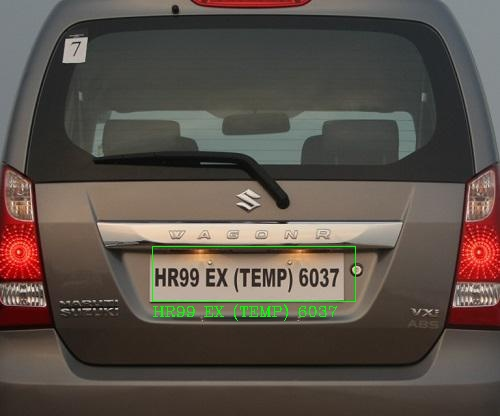

# Number-Plate-Detection-and-Recognition
Building a Custom License plate Detector and recognizer 

This repo let's you train a custom license plate detector using the state-of-the-art [YOLOv3](https://pjreddie.com/darknet/yolo/) computer vision algorithm.



The pytessaract OCR algorithm has been applied on the detected license plates to extract the text data.The code for pytessaract has been integrated as a separate class along with detection scripts in [`Number Plate Detection and Recognition/3_Inference]. 

Other ML algorithms like SVM, SVC and KNN3 were also tried for better performances. In case ML algorithms are to be used for text recognition, character segmentation has to be performed. Code for segmentation, Text prediction algorithms and trained models has been attached as an .ipynb file. 

1.Repo structure:
+ [`Dataset`]: Annotated license plate images for Indian vehicles.

+ [`Code`]: Scripts and instructions on testing your trained YOLO license plate detection model on new images and videos  cited from (https://github.com/antonmu/trainyourownyolo)

+ [`XML to CSV`]: XML to CSV for YOLO data prepartion

2.Getting Started:
The only hard requirement is a running version of python 3.3 or newer. To install the latest python 3.x version go to 
- [python.org/downloads](https://www.python.org/downloads/) 

and follow the installation instructions. 

3.Instructions:

3.1.Data Preparation
To annotate the image data you can use either LabelImg or VOTT. I used VOTT and for instructions on image annottions using VOTT, refer [`Number Plate Detection and Recognition/1_Image_Annotation/Readme.md`]. If you are using LabelImg and created a XML file for image label, you can create a csv file by running  

```
python XML_to_CSV.py
```

This will create a Annotations-export.csv file which has to be place in [`Number Plate Detection and Recognition/Data/Source_Images/Training_Images/VOTT_export`] along with images. If any file or directory name is modified, make sure to changes are updated in csv and other python scripts for detetion. 

3.2.License Plate detection and Recognition:
+ Create data_train.txt and data_classes.txt which will be used in retraining the YOLO model by running 

```
python “Number Plate Detection and Recognition/1_Image_Annotation/Convert_to_YOLO_format.py”
```

+ Download and convert the pre-trained YOLOv3 weights by running,
```
python “Number Plate Detection and Recognition/2_Training/Download_and_Convert_YOLO_weights.py”


python “Number Plate Detection and Recognition/2_Training/Train_YOLO.py”
```

The final weights are saved in [`Number Plate Detection and Recognition/Data/Model_weights`]. To list available command line options run `python Train_YOLO.py -h`.

+ To detect and recognize the license plate characters run the detector script using the command below:
```
python “Number Plate Detection and Recognition/3_Inference/NPR.py”
```

To detect multiple images or videos place the in put in [Number Plate Detection and Recognition/Data/Source_Images/Test_Images`] and then run 
```
python “Number Plate Detection and Recognition/3_Inference/NPR_Multiple.py
```
+ The outputs are saved to [`Number Plate Detection and Recognition/Data/Source_Images/Test_Image_Detection_Results`]. The outputs include the original images with bounding boxes and confidence scores as well as a file called [`Detection_Results.csv`] containing the image file paths and the bounding box coordinates. For videos, the output files are videos with bounding boxes and confidence scores. To list available command line options run `python Detector.py -h`.

4.Notes:
For  better results can try the following modifications:
+ Increase epochs while training for license plate detection.
+ Image enhancement before feeding for predition.
+ In case of videos, can try vehicle detection, segmentation, and then license plate detection to increaase the accuracy.
 
**To make everything run smoothly it is highly recommended to keep the original folder structure of this repo!**

Each `*.py` script has various command line options that help tweak performance and change things such as input and output directories. All scripts are initialized with good default values that help accomplish all tasks as long as the original folder structure is preserved. To learn more about available command line options of a python script `<script_name.py>` run:

```
python <script_name.py> -h
```
